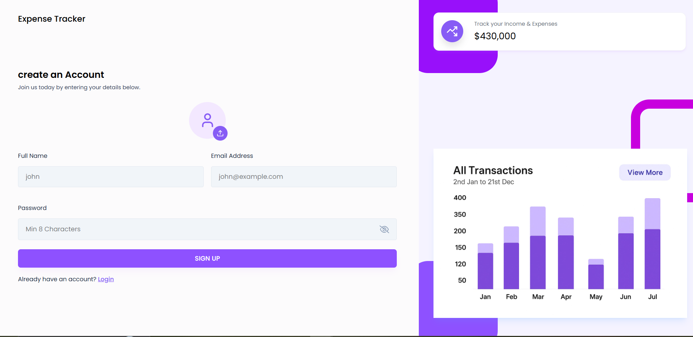
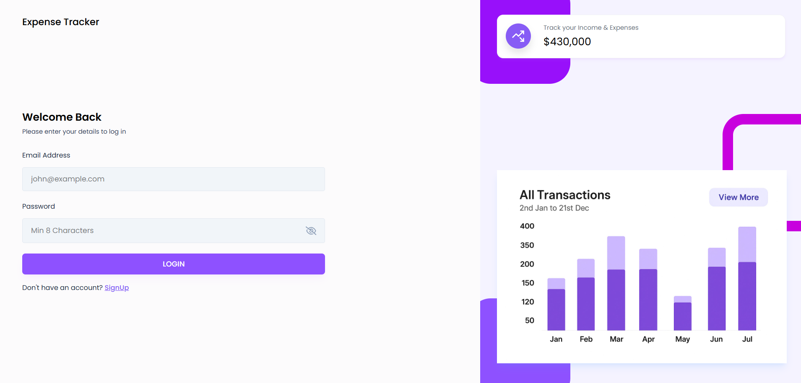
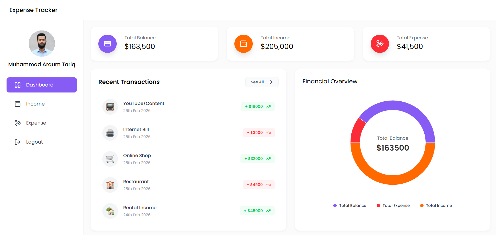
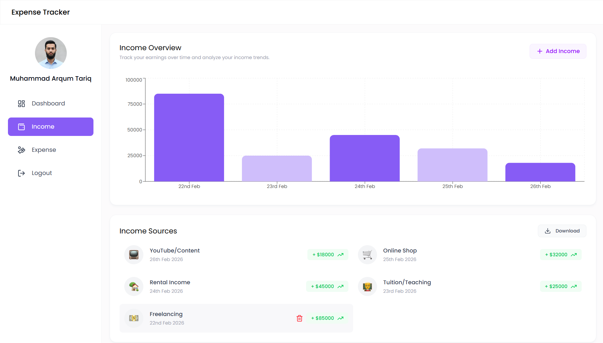
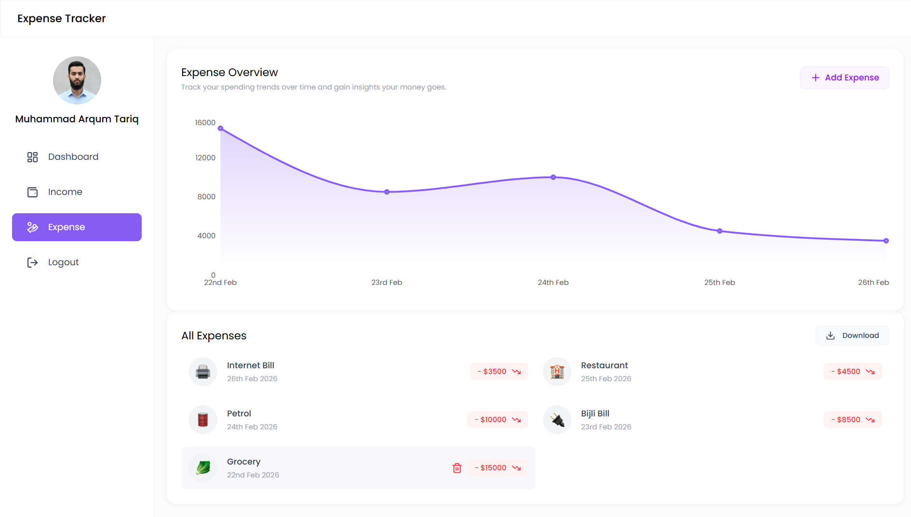

# 💰 MERN Expense Tracker

A modern, full-featured **Expense Tracker** web application built with the MERN stack. Users can sign up, log in, and manage their income and expenses with interactive charts, real-time balance tracking, and Excel export functionality.


---

## ✨ Features

### Frontend
- 🎨 **Modern UI/UX** — Fully responsive design with Tailwind CSS
- 📱 **Mobile-First** — Optimized for all screen sizes
- 📊 **Interactive Charts** — Income & expense trends with visual graphs
- 🔔 **Toast Notifications** — Real-time feedback on all actions
- 🎯 **Dynamic Routing** — Fast navigation with React Router

### Dashboard
- 💳 **Summary Cards** — Total Income, Total Expense & Balance at a glance
- 📈 **Financial Overview** — Pie chart for income vs expense breakdown
- 🕐 **Recent Transactions** — Latest income & expense records
- 📉 **60-Day Income Chart** — Visual donut chart for income trends

### Income Management
- ➕ **Add Income** — Log income with category, amount, date & icon
- 🗑️ **Delete Income** — Remove income records instantly
- 📥 **Download Excel** — Export income data as `.xlsx` file
- 📊 **Income Graph** — High/low visualization of income over time

### Expense Management
- ➕ **Add Expense** — Log expenses with category, amount, date & icon
- 🗑️ **Delete Expense** — Remove expense records instantly
- 📥 **Download Excel** — Export expense data as `.xlsx` file
- 📊 **Expense Graph** — Visual representation of spending trends

### Technical Features
- 🔐 **JWT Authentication** — Secure signup & login
- 🖼️ **Profile Image Upload** — Cloudinary integration
- ⚡ **Fast Performance** — Optimized React components with hooks
- 🔒 **Protected Routes** — Auth-based route protection

---

## 📸 Screenshots

### Signup Page


### Login Page


### Dashboard


### Income Page


### Expense Page


---

## 🚀 Tech Stack

### Frontend
| Technology | Usage |
|-----------|-------|
| React 18.x | UI Framework |
| Tailwind CSS | Styling |
| Recharts | Charts & Graphs |
| Axios | HTTP Client |
| React Hot Toast | Notifications |
| React Router DOM | Client-side Routing |

### Backend
| Technology | Usage |
|-----------|-------|
| Node.js | Runtime Environment |
| Express.js | Web Framework |
| MongoDB | NoSQL Database |
| Mongoose | ODM |
| JWT | Authentication |
| Bcrypt | Password Hashing |
| Cloudinary | Image Upload |
| XLSX | Excel Export |

---

## 📋 Prerequisites

Before running this project, make sure you have:

- **Node.js** (v18 or higher)
- **MongoDB Atlas** account
- **Cloudinary** account
- **npm** or **yarn** package manager

---

## ⚙️ Installation

### 1. Clone the Repository

```bash
git clone https://github.com/ARQUM21/mern-expense-tracker.git
cd mern-expense-tracker
```

### 2. Install Backend Dependencies

```bash
cd backend
npm install
```

### 3. Install Frontend Dependencies

```bash
cd ../frontend/expense-tracker
npm install
```

### 4. Environment Variables

Create a `.env` file in the `backend` directory:

```env
MONGO_URI=your_mongodb_connection_string
JWT_SECRET=your_jwt_secret_key
PORT=8000
CLOUDINARY_CLOUD_NAME=your_cloudinary_cloud_name
CLOUDINARY_API_KEY=your_cloudinary_api_key
CLOUDINARY_API_SECRET=your_cloudinary_api_secret
CLIENT_URL=http://localhost:5173
```

---

## 🎯 Running the Application

### Development Mode

**Start Backend Server:**
```bash
cd backend
node server.js
```

**Start Frontend:**
```bash
cd frontend/expense-tracker
npm run dev
```

The application will be available at:
- **Frontend:** `http://localhost:5173`
- **Backend API:** `http://localhost:8000`

### Production Build

```bash
cd frontend/expense-tracker
npm run build
```

---

## 🔑 API Endpoints

### Auth Routes
| Method | Endpoint | Description |
|--------|----------|-------------|
| POST | `/api/v1/auth/register` | Register new user |
| POST | `/api/v1/auth/login` | Login user |
| GET | `/api/v1/auth/getuser` | Get user info |
| POST | `/api/v1/auth/upload-image` | Upload profile image |

### Income Routes
| Method | Endpoint | Description |
|--------|----------|-------------|
| POST | `/api/v1/income/add` | Add income |
| GET | `/api/v1/income/get` | Get all income |
| DELETE | `/api/v1/income/:id` | Delete income |
| GET | `/api/v1/income/downloadexcel` | Download as Excel |

### Expense Routes
| Method | Endpoint | Description |
|--------|----------|-------------|
| POST | `/api/v1/expense/add` | Add expense |
| GET | `/api/v1/expense/get` | Get all expenses |
| DELETE | `/api/v1/expense/:id` | Delete expense |
| GET | `/api/v1/expense/downloadexcel` | Download as Excel |

### Dashboard Routes
| Method | Endpoint | Description |
|--------|----------|-------------|
| GET | `/api/v1/dashboard` | Get dashboard data |

---

## 🔒 Security Features

- ✅ JWT-based authentication
- ✅ Password hashing with bcrypt
- ✅ Protected API routes
- ✅ CORS configuration
- ✅ Environment variables for sensitive data

---

## 🤝 Contributing

Contributions are welcome! Please follow these steps:

1. Fork the repository
2. Create a new branch (`git checkout -b feature/amazing-feature`)
3. Commit your changes (`git commit -m 'Add some amazing feature'`)
4. Push to the branch (`git push origin feature/amazing-feature`)
5. Open a Pull Request

---

## 📄 License

This project is licensed under the MIT License - see the [LICENSE](LICENSE) file for details.

---

## 👨‍💻 Author

**Muhammad Arqum Tariq**

[](https://github.com/ARQUM21)
[](https://www.linkedin.com/in/muhammadarqumtariq/)
[](mailto:marqum987@gmail.com)

---

## 🙏 Acknowledgments

- React team for the amazing library
- Tailwind CSS for the utility-first CSS framework
- MongoDB team for the excellent database
- All open-source contributors

---

⭐ If you found this project helpful, please give it a star!

**Happy Tracking! 💰**
